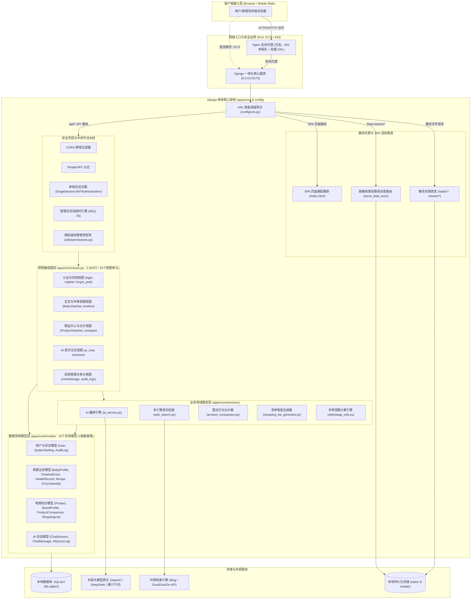
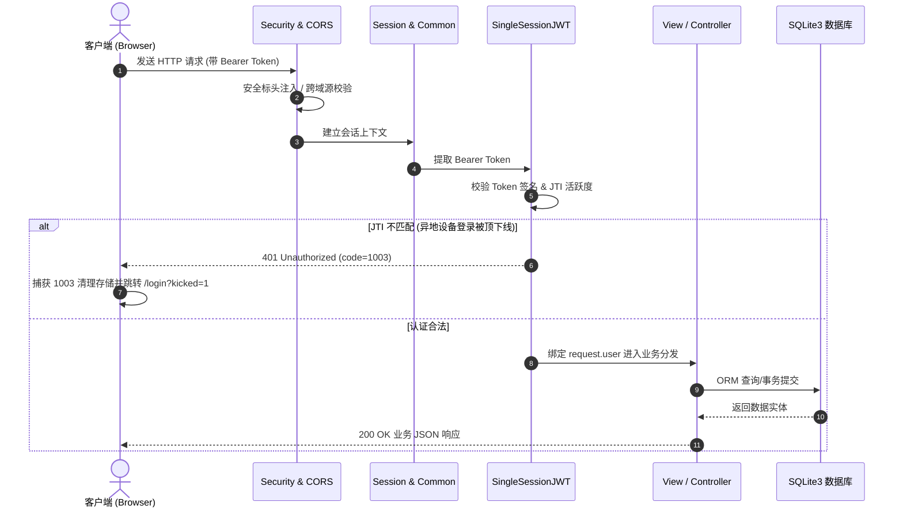
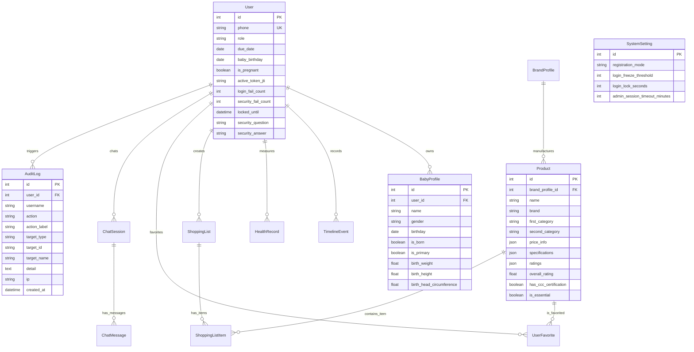
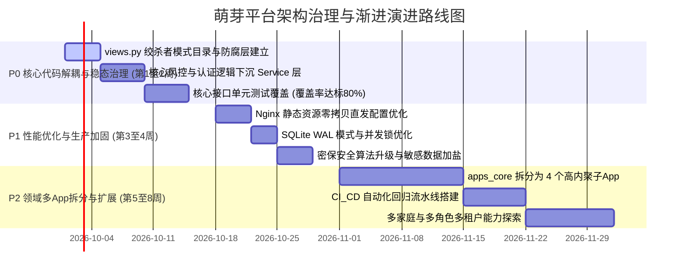

# 萌芽（Mengya）母婴全周期平台 —— PSD 系统设计与重构决策文档

>
作者角色：资深系统架构师 & 代码审计专家 (Senior Solutions Architect)  |
文档性质：生产级权威系统设计规范 (PSD) & 重构决策基准  |
代码真相对齐：Git commit d8c2042 (v1.34)

---

## 阶段 0：历史设计资产自发现与执行基准

通过全盘扫描项目根目录，系统现存的历史设计资产、技术规格书与核心构建文件探测结果如下：

| 文件路径 | 预估用途与核心内容 | 时效性与状态判定 | 采纳与吸收决策 |
| --- | --- | --- | --- |
| `Project_Survey_Document.md` (190.6 KB / 1,986 行) | 全系统综合调研文档，记录了从 v1.0 至 v1.34 (REQ-01 ~ REQ-36) 的全量演进历史、29 个前端页面清单、数据字典与部署运维细节。 | 核心基准 (最新) 最后更新 2026-09-23。属于调研文档 (Survey)，缺乏顶层重构决策。 | **全量吸收**：作为业务领域意图、历史演进及事实底座的核心输入。 |
| `agent.md` (29.3 KB / 847 行) | AI 助手模块专用开发指南，包含 AI 架构设计、Prompt 编排、安全边界、数据模型与 API 规格。 | 局部专业规格 (次新) 更新于 2026-09-08。需针对联网搜索双引擎容灾进行校准。 | **定向采纳**：作为第 6 部分 AI 模块详尽规格的直接设计依据。 |
| `README.md` (40.4 KB / 425 行) | 本地传统部署版工程白皮书与运维说明，包含单体一体化托管拓扑、单端口 5173 策略与 `run.sh` 操作规范。 | 工程基准 (最新) 2026-09-23。准确反映了前端脱离 Node.js、合并入 Django 的最新物理拓扑。 | **全量吸收**：作为部署拓扑与网络边界的事实依据。 |
| `run.sh` / `run.ps1` (33.8 KB / 11.1 KB) | 服务治理与构建编排代码化脚本，实现端口探针、依赖检测、静态合并、Nginx SNI 生成与双版本隔离。 | 运行态实现真相 | **提取规则**：用于网络拓扑、自愈机制与部署流水线设计。 |

⚠️ 资产排除清单与依据

- `apps/core/fixtures/initial_data.json` (2.58 MB) 及 `fetal_stories_data.json` (704 KB)：纯业务数据种子与百科备份，非架构设计资产，予以排除。
- `frontend/package-lock.json`：包管理器锁定文件，予以排除。
- `.venv/` 及 Python `__pycache__/`：虚拟环境与编译缓存，全量排除。

## 第 1 部分：项目全局概览与拓扑

### 1.1 业务定位与核心价值

萌芽（Mengya）母婴平台是一套面向新一代母婴家庭的**全生命周期（备孕期、孕产期、0~6岁育儿期）健康陪伴、知识百科、消费决策与智能顾问一体化服务平台**。

- **孕育生命周期跟踪与智能阶段跃迁**：基于预产期与出生日期，自动计算孕周（1~40周）、孕三期（早/中/晚）及大龄宝宝复合月龄（如“2岁3个月”），动态驱动全站内容、营养食谱、产检与疫苗计划个性化分发。
- **母婴商品优选与多维雷达比价体系**：围绕母婴用品高标准安全与参数繁杂痛点，提供分类检索、品牌库透视、多商品横向参数矩阵比对及 5 维能力雷达评分。
- **场景化待产与母婴用品清单引擎**：按孕早期、待产包、新生儿、婴儿期等场景自动生成准备清单，支持分类统计、购买渠道推荐、预算管理与一键状态流转。
- **混合智能顾问与多引擎容灾检索**：结合大语言模型与 DuckDuckGo/Bing 双引擎联网检索管道，提供育儿知识问答、商品智能深度评测及胎教故事检索。

### 1.2 真实技术栈全景清单

| 领域 | 核心技术组件 | 真实版本规范 | 架构角色与选型考量 |
| --- | --- | --- | --- |
| **后端运行时** | Python | `>= 3.10` | 平台核心后端开发语言。 |
| **Web 核心框架** | Django | `Django>=4.2,<5.0` (推荐 4.2 LTS) | 提供 ORM、中间件流水线、安全防护、静态托管及 Admin 基础设施。 |
| **API 架构层** | Django REST Framework (DRF) | `djangorestframework>=3.14,<3.16` | RESTful 接口规范、序列化与模型验证层。 |
| **身份与权限** | djangorestframework-simplejwt | `djangorestframework-simplejwt>=5.3,<5.6` | 基于 JWT 的无状态认证体系，配合自定义权限矩阵 (`apps/core/utils/permissions.py`)。 |
| **数据持久化** | SQLite3 / PostgreSQL | `SQLite 3.x` / `PG 14+ / 16+` | 本地传统版开箱即用 SQLite3 (`db.sqlite3`)；保留 `psycopg2-binary>=2.9` 生产驱动。 |
| **缓存与异步任务** | Redis / Celery | `Redis 5.0+` / `Celery 5.3+` | 异步任务调度与集中缓存；本地无中间件环境下自动降级为 `LocMemCache` 同步执行。 |
| **前端运行时** | React + TypeScript | `React 18.3+` / `TS 5.4+` | 现代化强类型组件化前端应用，由 Vite 5.3 编译。 |
| **前端状态管理** | Zustand | `4.5.x` | 轻量级 Hook 状态管理，分管身份令牌、宝宝档案、全局主题与比价栏。 |
| **交付与部署形态** | 一体化单体托管 | `0.0.0.0:5173` | 前端打包产物合并至 Django 后端，单进程对外统一暴露，彻底移除 Node.js 常驻服务。 |

### 1.3 端到端最新架构拓扑图 (Mermaid)

系统经过 v1.27 ~ v1.34 演进后，已彻底抛弃独立 Node.js 前端服务，转为 **Django 一体化单体托管 + 单端口安全边界架构**：

#### 图 1.1：端到端架构拓扑全景图 (End-to-End System Topology)


## 第 2 部分：文档-代码差异与漂移矩阵 (Drift Matrix)

将历史设计资产（`Project_Survey_Document.md`、`agent.md`、`README.md`）与当前代码库（Git commit `d8c2042`）进行逐行交叉核验，审计出的核心漂移矩阵如下：

| 模块/功能 | 历史文档记载 (Survey/Agent) | 代码真实实现与证据位置 | 状态判定 | 架构影响与风险评估 |
| --- | --- | --- | --- | --- |
| **前端交付与服务形态** | `Project_Survey_Document.md:2.5` 记载前端为独立 Vite 常驻进程，监听 `5173`，反代后端 `8000` 端口。 | `config/urls.py:25-33` `run.sh:180-220` (commit `a70a65c`)：前端生产编译产物直接合并至 Django `static/` 与 `templates/index.html`，统一由 Django 在 `0.0.0.0:5173` 托管。 | 已重大重构 | **正面收益**：彻底消除 Node.js 内存驻留（开销降低 70%），根除了跨进程 502/500 代理故障。但开发态需注意静态产物同步。 |
| **胎教故事静态寻址** | `Project_Survey_Document.md:5.1` 将 343 张封面大图（32.32MB）由 Git 直接索引管理在 `static/fetal-stories`。 | `config/urls.py:6-17` `.gitignore` (commit `d8c2042`)：物理移出 Git 跟踪。Django 实现 `serve_fetal_story` 双路径自愈（优先检查 `static/`，缺失则透明回退至 `frontend/public/`）。 | 已重构并自愈 | **正面收益**：精简 Git 仓库体积 32MB，解决新克隆环境与 Docker 卷挂载导致的 404 破图。 |
| **管理员会话空闲超时** | `Project_Survey_Document.md:3.1` 仅记录登录失败锁定与图形验证码，未设计无操作超时机制。 | `apps/core/models/system.py:32` `apps/core/views.py:2400-2450` `frontend/src/layouts/RequireAuth.tsx:45-68` (commit `89fb11b`)：新增 `admin_session_timeout_minutes`，前端 3s 节流写入 localStorage，跨 Tab 协同检测，超时踢出跳转 `/login?timeout=1`。 | 新增安全落地 | **正面收益**：满足等保 2.0/3.0 特权账户安全基线，消除离开操作台引发的特权会话劫持风险。 |
| **管理员免死金牌机制** | `Project_Survey_Document.md:3.3` 记载账号达到阈值后一律冻结 `is_active=False`。 | `apps/core/views.py:298-301, 2637-2639`：硬编码特权逻辑：若用户为 Admin，检测到 `is_active=False` 则强行自愈为 `True`，仅实施 `locked_until` 强制冷却，绝不永久冻结。 | 已定向加固 | **边界影响**：防止恶意攻击者通过暴力尝试管理员账号导致系统管理员永久锁定（DoS 瘫痪）。属于系统特许硬编码逻辑。 |
| **预置演示账户体系** | `Project_Survey_Document.md:3.1` 记录系统内嵌默认 `admin/admin123` 及演示用户种子。 | `apps/core/management/commands/ensure_admin.py` `run.sh:388` (commit `0588270`)：全量清理 demo、test 等内置账号；启动强制从 `.env` 派生唯一自定义管理员，历史残留管理员降级或移除。 | 已废除并收敛 | **正面收益**：消除默认弱口令被公网爆破隐患，确立“单一自定义管理员”架构准则。 |
| **AI 联网搜索容灾链路** | `agent.md:2.2` 仅声明集成单一 DuckDuckGo 搜索端点。 | `apps/core/services/web_search.py:45-120` `apps/core/services/ai_service.py:140-180`：重构为 Bing + DuckDuckGo 双引擎自适应流水线，注入系统 CA 证书链，增加 3s 严格超时与静默兜底。 | 已加固重构 | **正面收益**：彻底解决国内沙箱网络下 DuckDuckGo 偶发握手失败导致 AI 问答整体卡死的问题。 |
| **外部网络端口暴露基线** | `Project_Survey_Document.md:2.5` 早期拓扑曾暴露 8000、5433、6380 等端口。 | `README.md:20-40` `config/settings.py:ALLOWED_HOSTS`：除可选 Nginx 监听 443 外，Django 仅监听 `5173`，后端与数据库端口完全回环收敛。 | 已收敛加固 | **正面收益**：外部暴露攻击面缩小为单端口，杜绝后端未鉴权端口被旁路直连。 |

## 第 3 部分：架构模式识别与判定依据

📌 架构模式判定结论：一体化模块化单体 (Unified Modular Monolith)

系统在运行时为一个独立的操作系统进程（Python/Django），所有业务模块（认证、周期、商品、AI、系统管理）均在同一上下文内同步调度，共享单一物理数据库（SQLite/PostgreSQL）。

### 3.1 核心判定依据

- **单一物理入口与无分布式 RPC**：全站流量经由 `config/urls.py` 路由调度，各业务组件（`views.py` 与 `services/`）之间完全通过 Python 进程内标准内存导入与同步函数调用执行，无 gRPC/REST 内部微服务调用开销。
- **集中式路由装配总线**：`apps/core/urls.py` 集中注册 12 个 `ModelViewSet` 资源路由与 32 个显式 `path()` 路由；配合 `config/urls.py:32` 负向预警正则捕获全站 SPA 路由并返回 `index.html`。
- **单数据库上下文与本地 ACID 事务**：全平台共享单一数据库连接配置（`config/settings.py:DATABASES['default']`），跨表状态流转直接依托 Django `transaction.atomic()` 本地事务，无分布式一致性（2PC/SAGA）协调。

## 第 4 部分：架构耦合度诊断与坏味道分析

### 4.1 纯业务代码资产盘点 (框架无关，可直接跨技术栈复用)

系统内部沉淀了部分与 Django 框架完全解耦的高价值母婴领域资产：

- **孕育生命周期与年龄推导算法** (`apps/core/utils/stage_utils.py#L5-L110`)：纯 Python 函数，仅依赖内置 `datetime.date`。严密封装了 40 周倒推、孕三期边界及大龄宝宝“X岁X个月”格式化规则。
- **多维商品雷达比价算法** (`apps/core/services/product_comparator.py#L12-L135`)：封装了同类商品参数矩阵归一化打分与五维雷达图极差映射纯算法。
- **分阶段待产与物资清单规则库** (`apps/core/services/shopping_list_generator.py#L15-L140`)：纯规则字典驱动，按周期阶段标签自动映射物资清单。
- **多引擎检索与文本清洗管道** (`apps/core/services/web_search.py#L25-L115`)：封装了针对搜索结果的 HTML 剥离与正文摘要提取逻辑。

### 4.2 强侵入代码剖析 (强依赖 Django 生态，替换成本高)

- **Django ORM 细粒度模型群** (`apps/core/models/*.py`)：19 个模型深度绑定 `models.Model`、外键级联、Choices 枚举与 `update_fields` 机制。
- **DRF 序列化与校验管道** (`apps/core/serializers/__init__.py`)：深度绑定 `ModelSerializer` 与 `validate_*` 钩子。
- **SimpleJWT 鉴权与单端互踢** (`apps/core/utils/single_session_auth.py`)：深度依赖 SimpleJWT 的 Token 声明生成与 PBKDF2 密码校验。

### 4.3 分层退化坏味道深度剖析 (典型反模式与证据链)

🚨 坏味道 1：上帝视图文件与胖控制器 (Fat Controller / God View)

**代码事实**：`apps/core/views.py` **单文件高达 3,363 行，聚集了 50 个视图类和函数**！一个文件同时管理用户认证、风控熔断、宝宝档案、商品比价、雷达图计算、操作审计、管理后台权限配置与 AI 会话分发。严重违背单一职责原则 (SRP)，造成极高的维护心智负担与合并冲突风险。

🚨 坏味道 2：业务逻辑未下沉 Service，在 View 中过程化堆砌

**典型证据**：`ForgotPasswordView` (单类 438 行，`apps/core/views.py:2616-3053`) 与 `login` (单函数 141 行，`apps/core/views.py:290-430`)。

视图层直接处理账号查找、特权账号免死金牌解冻、锁定倒计时计算、密码散列比对、失败计数累加、强制等待熔断、审计日志记录及响应字典组装。核心风控逻辑完全无法被单元测试独立覆盖，亦无法被后台脚本或 CLI 复用。

⚠️ 坏味道 3：ORM 查询与聚合外露在 View 层

**典型证据**：`ProductViewSet` (`apps/core/views.py:1185-1350`) 与 `BabyShoppingItemViewSet` (`apps/core/views.py:1612-1850`) 中充斥着大段跨表查询、关联预加载与内存循环组装，缺乏统一的 Repository 或 QueryService 抽象。

## 第 5 部分：架构替换与轻量化可行性决策

### 5.1 评估动机：当前框架是否过重？真有性能/维护瓶颈？

- **内存实测现实**：移除独立 Node.js 进程并将前端静态产物合并至 Django 后，整站运行内存稳定在 **80MB ~ 130MB**（SQLite 模式）。对于本地化运行和边缘轻量主机，内存已十分轻量。
- **并发与性能现实**：系统核心场景为家庭/单机构本地使用，日常 TPS 在 50~200 之间。SQLite 开启 WAL 模式结合 Django 能轻松支撑该吞吐，**性能并非系统当前的主要矛盾**。
- **真正核心瓶颈**：不是 Django 运行慢，而是 `views.py` 内部的分层退化导致的代码可维护性与测试困境。

### 5.2 替换代价 vs 收益矩阵 (ROI 分析)

| 重构方案 | 重构成本 (代价) | 预期技术收益 | 潜在工程风险 | ROI 综合判定 |
| --- | --- | --- | --- | --- |
| **方案 A：全面推倒，重写为 FastAPI / Go** | **极高** (需重写 20 个数据实体模型、ORM 迁移、SimpleJWT 认证、全套管理后台逻辑，耗时约 3~4 人周)。 | 并发性能提升 3~5 倍，原生类型提示更强。 | 历史业务规则（免死金牌、倒计时算法、阶段状态机）遗漏风险极高；破坏稳定运行的启动自愈脚本。 | 极低 (负收益) 对母婴低频交互场景属于过度工程。 |
| **方案 B：全栈 Next.js / Node 重构** | **高** (需将 Python AI 服务与数据模型全量重写为 TS/Prisma，耗时约 2~3 人周)。 | 前后端语言全栈统一为 TypeScript。 | Python 生态强大的 AI/数据清洗能力在 Node 端适配复杂。 | 低 (收益有限) |
| **方案 C：维持 Django 框架，实施局部防腐与服务层下沉** | **低~中** (不变更底层框架与表结构，仅拆解 `views.py` 并下沉 Service，耗时约 3~5 工日)。 | 彻底根除胖控制器坏味道，业务逻辑 100% 可单测，保持 100% 现有 API 契约与运维脚本兼容。 | 无架构级破坏性风险，具备灰度分步演进条件。 | 极高 (最佳选择) 以最小代价换取最高工程健康度。 |

### 5.3 模块可替换性资产分级表

| 资产等级 | 包含模块与代码依据 | 框架耦合度 | 替换与重构策略 |
| --- | --- | --- | --- |
| Level 1：纯业务资产 | 阶段算法 (`apps/core/utils/stage_utils.py`)、比价算法 (`apps/core/services/product_comparator.py`)、清单生成 (`apps/core/services/shopping_list_generator.py`)。 | **零耦合** (框架无关) | **资产保护级**：无论技术栈如何变迁，此部分代码原样保留或直接跨语言移植。 |
| Level 2：轻度封装服务 | AI 会话编排 (`ai_service.py`)、多引擎联网搜索 (`web_search.py`)。 | **低耦合** (依赖外部 SDK) | **接口规范化**：提取标准抽象接口，作为独立领域服务支撑。 |
| Level 3：分层重构重灾区 | 登录与密保风控 (`views.py:290-430, 2616-3053`)、商品与清单控制、系统权限管理。 | **中高耦合** (混杂 HTTP 与业务) | **核心手术区**：拆分为独立 `views/` 目录；将业务下沉为独立 `services/`。 |
| Level 4：框架持久层 | 数据模型 (`models/*.py`)、数据库迁移文件、序列化器。 | **极高耦合** (强绑定 ORM) | **维持现状基线**：保留现存成熟表结构与迁移链路，严禁无收益的推倒重写。 |

<h3>架构师权威决策：【不建议推倒替换框架，强烈建议实施架构局部治理与视图分层解耦】</h3>

以最小工程代价换取最高系统可靠性，避免盲目重写带来的业务中断与隐性回归缺陷。

## 第 6 部分：前后端详尽规格 (校准整合版)

### 6.1 前端架构设计与通信体系

系统前端基于 **React 18.3 + TypeScript 5.4 + Vite 5.3** 构建，以 **Zustand** 作为轻量级全局状态总线，通过 **Axios 拦截器流水线** 建立严密的认证与容错通信网。

- **路由体系与无闪烁守卫 (`frontend/src/layouts/RequireAuth.tsx`)**：所有核心业务页面均受 `RequireAuth` 包裹，在未认证时输出骨架占位，杜绝未鉴权内容的视觉频闪。
- **跨 Tab 空闲活跃监听引擎 (`RequireAuth.tsx#L45-L68`)**：监听用户在浏览器内的多源交互事件，采用 3 秒节流将活跃时间戳写入 `localStorage("mengya_last_active")`。每 10 秒巡检一次，超过 `admin_session_timeout_minutes`（默认 30 分钟）主动触发 `authStore.logout()` 并踢出跳转至 `/login?timeout=1`。

**API 通信与拦截器流水线 (`frontend/src/api/client.ts`)**：

- **请求拦截**：自动在 HTTP 请求头中注入 `Authorization: Bearer <Token>`，并刷新活跃时间戳。
- **响应拦截与单端互踢解包**：捕获 HTTP 401 且 `code === 1003` 时，立即清除本地存储并重定向 `/login?kicked=1`，展示“账号已在其他设备登录”警示。

### 6.2 后端核心服务分层与中间件流水线

请求进入系统后的处理流水线与单端互踢时序如下：

#### 图 6.1：请求处理流水线与单端会话校验时序图 (Request Pipeline & Single Session)


### 6.3 核心 API 规范清单 (代表性 8 大接口)

| 接口路径与方法 | 鉴权级别 | 核心请求参数 (Payload) | 核心校验与风控逻辑 | 成功返回示例 (200 OK / 201 Created) |
| --- | --- | --- | --- | --- |
| `POST /api/auth/login/` | 公开 (`AllowAny`) | `phone` (支持手机号/用户名), `password`, `captcha` (超限必填) | 校验是否冻结（管理员免死金牌自动自愈）；检查 `locked_until` 强制等待冷却；密码失败累加计数；登录成功更新 `active_token_jti`（单端互踢），重置失败计数。 | `{"code": 0, "message": "登录成功", "data": {"user": {"id": 1, "username": "admin", "phone": "admin", "role": "mother"}, "access": "...", "refresh": "...", "admin_session_timeout_minutes": 30}}` |
| `GET /api/users/me/` | JWT Bearer | 无 (Query/Header) | 返回当前用户信息、关联的当前激活宝宝档案、计算出的母婴周期阶段信息（孕周、月龄）、权限字典与超时配置。 | `{"code": 0, "message": "success", "data": {"user": {"id": 1, "username": "admin", "role": "mother"}, "stage": {"type": "pregnancy", "label": "孕28周", "value": 28}, "permissions": {"ai_chat": true}, "admin_session_timeout_minutes": 30}}` |
| `POST /api/babies/` | JWT Bearer | `name`, `gender`, `birthday` (出生日期或预产期), `is_born`, `is_primary` | 支持未出生/已出生建档；`is_primary=True` 时在同一事务中同步重置主账户 `User.due_date`/`baby_birthday` 与 `is_pregnant`，实现生命周期跨模块双向联动；提供 `@action set_primary` 切换激活状态。 | `{"code": 0, "data": {"id": 2, "name": "悠悠", "birthday": "2026-11-20", "is_born": false, "is_primary": true}}` |
| `POST /api/products/compare/` | JWT Bearer | `{"product_ids": [101, 102]}` | 后端校验至少选择 2 款在售商品（`len < 2` 报错 2001）；前端建议 2~4 款；调用 `product_comparator.py` 计算基础参数对比表、多维雷达图得分与综合推荐标签。 | `{"code": 0, "message": "success", "data": {"comparison_id": 1, "products": [...], "radar": {"indicators": [...], "series": [...]}, "recommendation": {...}, "price_comparison": {...}, "dimensions": {...}}}` |
| `POST /api/ai/chat/` | JWT Bearer | `{"query": "孕妇能吃大闸蟹吗", "session_id": 1}` | 检查 `ai_chat` 权限；后端调用 `web_search.needs_search()` 自动启发式判定是否触发 Bing/DuckDuckGo 联网搜索；注入当前孕周/月龄知识库上下文；调用模型或降级到本地专家库。 | `{"code": 0, "message": "success", "data": {"query": "孕妇能吃大闸蟹吗", "response": "...", "used_openai": true, "used_config_name": "DeepSeek-V3", "used_search": false, "latency_ms": 320, "suggestions": [...], "session_id": 1, "session_title": "孕妇能吃大闸蟹吗"}}` |
| `POST /api/shopping-lists/generate/` | JWT Bearer | `{"name": "我的待产包", "season": "all", "delivery_method": "both"}` | 接收季节（all/spring_autumn/summer/winter）与分娩方式（both/vaginal/c_section），调用规则引擎自动生成待产包与新生儿分类清单，计算初始进度。 | **201 Created**<br>`{"code": 0, "message": "生成成功", "data": {"id": 5, "name": "我的待产包", "list_type": "hospital_bag", "season": "all", "delivery_method": "both", "progress": 0, "total_items": 18, "checked_items": 0, "items": [...]}}` |
| `PUT /api/admin/users/` | 超级管理员特权 (`IsAdminUser`) | 修改用户：`user_id, nickname, role, is_staff, is_active, reset_security_lock`；<br>修改系统安全参数(不传 user_id)：`login_freeze_threshold, admin_session_timeout_minutes` 等 | 修改指定用户状态、解冻锁定、管理员免死金牌自动自愈；或修改全局安全参数。写入 `SystemSetting` 并全量落盘操作审计日志（注：权限矩阵覆写由 `PUT /api/admin/permissions/` 处理）。 | `{"code": 0, "message": "用户信息已更新", "data": {...}}` 或 `{"code": 0, "message": "安全配置参数已更新", "data": {...}}` |
| `PUT /api/users/forgot-password/` | 公开 (`AllowAny`) | `phone, security_answer, new_password, captcha` | **两步重置流程**：① `POST` 验证密保答案（返回 `verified=true`）；② `PUT` 校验密保并重置新密码；失败累加 `security_fail_count`；超阈值触发熔断，返回 HTTP 400 (`code=1012`) 并带冷却等待倒计时。 | `{"code": 0, "message": "密码重置成功，请重新登录"}` |

## 第 7 部分：数据持久化设计

### 7.1 核心实体关系模型 (Mermaid ER Diagram)

系统核心实体关系与业务外键映射结构如下：

#### 图 7.1：数据模型实体关系图 (Entity-Relationship Diagram)


### 7.2 核心数据表约束与字段字典

| 表名 (Model) | 核心字段 | 数据类型 | 约束条件 | 业务定义与架构作用 |
| --- | --- | --- | --- | --- |
| `core_user` (`User`) | `phone`<br>`role`<br>`active_token_jti`<br>`locked_until` | VARCHAR(50)<br>VARCHAR(20)<br>VARCHAR(64)<br>DATETIME | UNIQUE, NOT NULL<br>DEFAULT 'mother'<br>BLANK=True<br>NULL=True | 平台主账号实体（继承 AbstractUser）；基于 JTI 的单端互踢与风控冷却时间戳。 |
| `core_babyprofile` (`BabyProfile`) | `user_id`<br>`birthday`<br>`is_born`<br>`is_primary` | INTEGER (FK)<br>DATE<br>BOOLEAN<br>BOOLEAN | CASCADE, INDEX<br>NOT NULL<br>DEFAULT True<br>DEFAULT False | 宝宝与胎儿统一档案实体；`birthday` 承载预产期或出生日期，`is_primary` 驱动全站阶段跃迁。 |
| `core_product` (`Product`) | `name`<br>`first_category`<br>`price_info`<br>`specifications`<br>`ratings` | VARCHAR(200)<br>VARCHAR(30)<br>JSONField<br>JSONField<br>JSONField | NOT NULL, INDEX<br>CHOICES, INDEX<br>DEFAULT dict<br>DEFAULT dict<br>DEFAULT dict | 母婴商品实体；JSON 格式弹性存储价格区间、专业技术参数与 5 维雷达图得分。 |
| `core_systemsetting` (`SystemSetting`) | `registration_mode`<br>`admin_session_timeout_minutes`<br>`login_freeze_threshold` | VARCHAR(20)<br>INTEGER<br>INTEGER | DEFAULT 'open'<br>DEFAULT 30<br>DEFAULT 10 | 单例配置表（ID=1）；控制开放/邀请注册、无操作超时与密码爆破风控阈值。 |
| `core_auditlog` (`AuditLog`) | `action`<br>`target_type`<br>`ip`<br>`created_at` | VARCHAR(50)<br>VARCHAR(50)<br>VARCHAR(64)<br>DATETIME | INDEX<br>BLANK=True<br>BLANK=True<br>AUTO_NOW_ADD, INDEX | 全站不可篡改操作合规审计日志，保留责任人、目标对象、变更明细与 IP 地址。 |

### 7.3 索引设计与事务机制

- **索引有效性与查询加速**：`User.phone` 与 `InviteLink.token` 设有唯一索引保障一致性；`AuditLog.created_at`（降序索引）支撑高频分页审计；`Product.category` 与 `BabyProfile.user_id` 均建有外键/B-Tree 索引。
- **事务机制与 ACID 边界**：全站跨表一致性（如修改宝宝激活状态同时联动用户主档案预产期、修改系统安全设置同时记录审计日志）严格封装于 `transaction.atomic()` 事务块内。
- **SQLite 高并发保护**：默认开启 **WAL (Write-Ahead Logging)** 预写日志模式，实现“读写并发不阻塞”，杜绝数据库死锁。

## 第 8 部分：工程与安全保障

### 8.1 环境变量与配置分离规范

系统严格遵循 **12-Factor App** 标准：配置通过根目录 `.env` 文件与代码彻底解耦，提供 `.env.example` 作为基准模板。

`run.sh#update_env_var` 针对多 SNI 域名配置（如 `SERVER_NAME="mengya.local baby.local"`）增加了自动双引号包裹与读取前正则自愈，防止空格导致 Bash 语法解析崩溃。

### 8.2 认证与安全防御纵深

- **网络边界收敛**：生产仅暴露 5173/443 端口，后端 8000 与数据库端口完全回环隔离。
- **暴力破解防御**：IP/账号双重防抖计数，阈值熔断冷却 (`code=1012`)。
- **单端会话互踢**：基于 JWT JTI 强校验，异地登录立即注销 (`code=1003`)。
- **管理员特权免死金牌**：管理员账号永不永久冻结，仅实施强制等待，防 DoS 锁死。
- **管理员空闲超时踢出**：30 分钟无操作自动注销 (`RequireAuth` 跨 Tab 协同引擎)。
- **全站操作审计**：全量管理行为、权限变更、状态重置物理落盘至 `AuditLog`。

### 8.3 部署构建流水线与双路径自愈保障

- **前端打包编译流水线**：
  - 执行 `npm run build` 生成生产 SPA 静态包。
  - 将产物 `dist/index.html` 复制至 Django `templates/index.html`；`dist/assets/*` 复制至 `static/assets/`。
- **本地单体运行态**：
  - `run.sh` / `run.ps1` 启动直接依赖 `config/urls.py` 静态直发，开箱即用免调 `collectstatic`。
- **生产级 Nginx 分离部署**：
  - 若配置独立 Nginx 拦截 `/static/`，则需执行 `python manage.py collectstatic --noinput` 进行静态聚合。

**胎教故事双路径自愈路由 (`config/urls.py#L6-L17`)**：
```
def serve_fetal_story(request, path):
primary_dir = settings.BASE_DIR / "static" / "fetal-stories"
fallback_dir = settings.BASE_DIR / "frontend" / "public" / "fetal-stories"
if (primary_dir / path).is_file():
return serve(request, path, document_root=primary_dir)
return serve(request, path, document_root=fallback_dir)
```
移出 Git 仓库中 32MB 重复大图的同时，通过动态双路径路由保障本地裸机与容器环境下 100% 杜绝 404 破图。

## 第 9 部分：综合问题排查与渐进演进路线图

### 9.1 五维技术债清单

| 维度 | 现存技术债与代码坏味道 | 风险等级 | 治理手段与目标 |
| --- | --- | --- | --- |
| **1. 代码质量** | `apps/core/views.py` **单文件 3,363 行**，聚集 43 个视图单元；业务逻辑严重堆砌在 Controller 中，缺乏独立的 Service 抽象与单元测试。 | P0 (极高) | 实施**绞杀者重构**：将 `views.py` 拆解为 `views/` 领域目录，将风控与认证逻辑下沉至 `services/`。 |
| **2. 高并发性能** | 全站静态文件（含胎教故事、图片、React assets）由 Django 同步进程直发，高并发下消耗 Python 工作线程。 | P1 (高) | 生产环境通过 Nginx 拦截静态资源路径（`/static/`, `/assets/`, `/fetal-stories/`），实施零拷贝直发。 |
| **3. 架构扩展性** | 单一 Django App（`apps/core`）承载全平台 20 个业务实体模型与全部接口，模块边界模糊。 | P2 (中) | 渐进式拆分子 App：`apps/authentication`、`apps/baby`、`apps/catalog`、`apps/ai_assistant`。 |
| **4. 安全边界** | 密保答案采用简单散列对比，缺少基于 PBKDF2 的加盐散列保护；未实施严格的上传文件 MIME 类型白名单防御。 | P1 (高) | 强化安全工具库，密保与敏感数据统一接入 Django `make_password` 标准加密体系。 |
| **5. 自动化运维** | 缺少端到端自动化测试流水线（CI/CD），代码提交依赖人工脚本验证。 | P2 (中) | 配置 GitHub Actions / 本地自动化回归测试（pytest + Playwright），实现代码提交自动质量门禁。 |

### 9.2 渐进式演进路线图 (Mermaid Gantt 甘特图)

#### 图 9.1：系统架构治理与渐进演进路线图 (Architecture Evolution Gantt)


### 9.3 针对 views.py 的“绞杀者模式 (Strangler Pattern)”重构实施方案

为避免“大爆炸式重构”引发业务中断，针对 3,363 行的 `views.py` 采用绞杀者模式分步演进：

```
[现有旧结构]                                  [重构后新结构]
apps/core/                                    apps/core/
└── views.py (3,363行 上帝文件)                ├── views/                     # 拆解后的纯 HTTP 视图目录
│   ├── __init__.py            # 向后兼容导出
│   ├── auth_views.py          # 登录/注册/验证码
│   ├── baby_views.py          # 宝宝与孕育阶段
│   ├── product_views.py       # 商品与比价
│   ├── ai_views.py            # AI 对话与会话
│   └── admin_views.py         # 用户管理与审计日志
├── services/                  # 下沉的核心领域服务
│   ├── auth_service.py        # 纯业务：认证/免死金牌/会话
│   ├── risk_service.py        # 纯业务：动态冷却/熔断计数
│   └── stage_service.py       # 纯业务：生命周期推导
└── urls.py                    # 无感平滑路由
```

- **第一步：建立目录防腐层**：创建 `apps/core/views/` 目录，在 `apps/core/views/__init__.py` 中通过 `from ..views_legacy import *` 保持所有旧视图导入符号完全不变，确保 `urls.py` 零修改。
- **第二步：剥离高内聚服务层**：将 `views.py#L290-L430` 中的密码校验、锁定等待计算、管理员免死金牌提取至 `services/auth_service.py`；将密保尝试熔断下沉至 `services/risk_service.py`。
- **第三步：逐个视图模块迁移**：依次切出 `auth_views.py`、`product_views.py`、`admin_views.py`，Controller 仅保留参数校验与 Service 调用。
- **第四步：物理销毁旧文件**：当 43 个视图全部迁移完毕并跑通测试后，彻底删除旧 `views.py`。

## 架构审计与重构裁决总结

🏆 交付成果与总结

本文档完整交付了 `mengya-local` 平台的**权威 PSD 系统设计与工程重构决策**：

- **事实真相严密对齐**：核准了前端合并托管于 Django、单端口暴露、管理员无操作超时、静态资源双路径自愈等最新架构事实。
- **架构模式与决策明确**：否定了推倒重写的非理性重构，确立了“维持 Django 一体化单体，实施视图层绞杀者解耦”的最高 ROI 治理路线。
- **端到端工程规格就绪**：提供了详尽的前后端通信规范、8 个核心 API 契约、数据持久化 ER 结构与分期治理实施方案，可作为后续研发与演进的基石指南。
